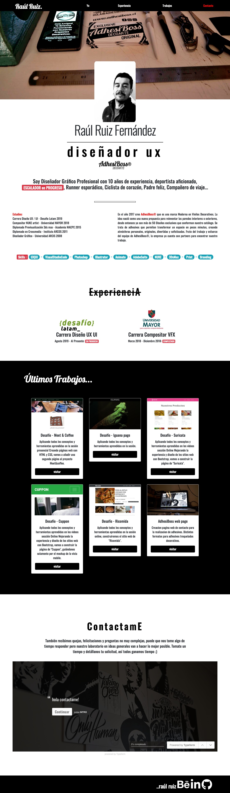

# Prueba - Mi Portafolio
> Construye un landing page, este será un portafolio web que integre todas los desafíos realizados
anteriormente.



## Requisitos generales

- El sitio web debe ser responsivo.
- Debe incluir una grilla.
- El sitio web debe estar construido usando la filosofía Mobile First.
- Se debe integrar a lo menos un servicio externo de formularios de contacto (Typeform).
- Se debe usar a lo menos 2 componentes de bootstrap que incluyan JavaScript. (Carousel, tooltips, entre
otros).
- La página debe tener una barra de navegación con links que lleven a las diferentes secciones de la
página web.
- Todas las páginas deben contener un footer que incluya íconos de redes sociales.
- Se deben usar 1 o 2 tipos diferentes de fuentes (En el caso de ser 1 tipo de fuente, contrastar esta con a
lo menos un peso de fuente).
- Se deben usar a lo menos 3 tipos diferentes de componentes de bootstrap (excluyendo las componentes
con JavaScript)
- La página debe tener titulares y subtitulares para las secciones.
- Se debe a lo menos 4 clases utilitarias de Bootstrap.


## Requisitos específicos

La página debe contener 6 secciones que incluyan:
- Organización e indentado del código .
- Una barra de navegación fija en la parte superior de la pantalla, con links a diferentes secciones de tu
página, haciendo un smooth scroll.
- Una sección en la que aparezca tu foto como fondo.
- Una sección el cual hagas una descripción sobre ti, que contenga un titular y dos párrafos (debe
desaparecer en tamaños pequeños de pantalla).
- Una sección que incluya tu experiencia (si no tienes experiencia como desarrollador usa tus últimos dos
puestos de trabajo para esta sección o en su defecto, tus estudios).
- Una sección donde aparezcan tus últimos trabajos realizados *(Si aún no tienes alguno, utiliza los
desafíos realizados en las sesiones presenciales. Las fotos se encuentran en el archivo Assets -
Prueba.zip)*.
- Una sección de formulario de contacto con Typeform.
- Una sección footer con links a tus redes sociales.


```sh
/assets/img para las imágenes
/assets/css/style.css para el archivo CSS
/assets/js/script.js para el archivo JavaScript
/index.html
```
